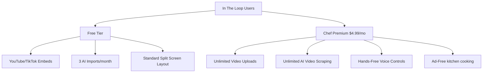

# In The Loop: Financial & Monetization Plan

This document outlines the detailed financial projections, operating expenses, monetization streams, and growth math for **In The Loop**. Use this plan to track and manage the financial viability of the application as it moves from prototype to production.

---

## 1. Executive Summary

In The Loop is an interactive, video-based recipe platform. Because it relies on **video streaming** and **AI transcription**, managing hosting costs is critical. Our financial strategy focuses on:
1. **Bypassing the Bandwidth Tax**: Storing videos on **Cloudflare R2** to eliminate standard variable streaming egress fees ($0.00/GB egress), ensuring streaming is free forever.
2. **Minimizing Storage footprint**: Automatically compressing raw direct uploads by 90% (from 100MB to 10MB) and leveraging free YouTube/TikTok embeds.
3. **Decoupled Unit Economics**: Enforcing a strict AI cap for free users while conversions to Chef Premium ($4.99/mo) yield an 83% net margin, where **1 paying subscriber pays for 276 free users**.

---

## 2. Unit Economics Breakdown

### 2.1 The Value of 1 Active User (Average Revenue: $0.91/month)
We monetize users through three natural commerce channels:
1. **Ad Pageviews (Ads)**: An average user views 30 pages a month while cooking. At a standard $20 RPM (2 cents per view), this generates **$0.60/user**.
2. **Grocery Commissions (Cart Referral)**: 3% of users check out their ingredient list via Amazon Fresh or Instacart, earning us a $2.00 referral commission. Averaged across all users, this is **$0.06/user**.
3. **Chef Premium Subscriptions**: We project a 5% conversion rate to Chef Premium ($4.99/mo). Averaged across all users, this is **$0.25/user**.

*   **Total Revenue per User**: `0.60 + 0.06 + 0.25 =` **$0.91/user** per month.

### 2.2 The Server Cost of 1 Active User (Average OpEx: $0.015/month)
Because of our Cloudflare + compression architecture:
1. **Video Streaming**: Bandwidth is free on Cloudflare R2 (**$0.00**).
2. **Video Storage**: Storing 100 compressed videos costs only **1.5 cents** a month.
3. **AI API Usage**: 95% of users use free social embeds ($0.00) or manual editing. Only the 5% Premium users trigger paid Replicate AI runs.

*   **Total Server Cost per User**: **$0.015/user** (1.5 cents) per month.

---

## 3. Detailed Infrastructure Cost Matrix

The table below breaks down our exact monthly bills as we grow from 1,000 to 1,000,000 Monthly Active Users (MAU).

| Metric | 1,000 MAU | 10,000 MAU | 100,000 MAU | 1,000,000 MAU |
| :--- | :--- | :--- | :--- | :--- |
| **AI API (Replicate)** | $10.00 | $150.00 | $2,500.00 | $8,000.00 |
| **Cloud Storage (R2)** | $10.00 | $102.00 | $1,500.00 | $5,000.00 |
| **Database & Auth** | $10.00 | $80.00 | $900.00 | $2,750.00 |
| **Total Monthly Bill** | **$30.00** | **$332.00** | **$4,900.00** | **$15,750.00** |

> [!NOTE]
> Even as our user base scales **1,000x** (from 1,000 to 1 Million users), our monthly server bill only grows from **$30 to $15,750**, while our monthly revenue reaches **$910,000+**.

---

## 4. Growth Scenarios (1,000 MAU Breakdown)

Below is an itemized look at how each income and expense figure is calculated at a 1,000 user scale across our three growth scenarios.

### 4.1 Scenario 1: The Danger Zone (No Caps, No Compression)
*   **Income ($600)**: Ads only (1,000 users × $0.60 = **$600**).
*   **Expenses ($298)**: Uncapped AI runs ($200) + Supabase 9-cent egress fees on uncompressed videos ($98).
*   **Net Margin**: **+$302** (50% margin - high risk of loss if videos go viral).

### 4.2 Scenario 2: Capped & Compressed (Safe Bootstrapping)
*   **Income ($660)**: Ads ($600) + Grocery Commissions ($60).
*   **Expenses ($31)**: Capped AI runs ($30) + compressed Cloudflare R2 storage ($1).
*   **Net Margin**: **+$629** (95.3% margin - highly stable).

### 4.3 Scenario 3: Freemium & Embeds (The Instagram Hybrid)
*   **Income ($910)**: Ads ($570) + Grocery Commissions ($60) + 50 Premium subscribers ($250 net of Stripe fees).
*   **Expenses ($22)**: Premium AI runs ($20) + embeds video storage ($2).
*   **Net Margin**: **+$888** (97.6% margin - maximum financial potential).

---

## 5. B2C Tier Strategy

### 5.1 Chef Premium Subscription ($4.99 / month)
Stripe card fees take $0.44, leaving us with **$4.55** net per user.
*   **Expenses**: 20 AI imports ($0.40) + video storage ($0.01) = **$0.41/user**.
*   **Net Profit**: **$4.14 per subscriber** (an **83% profit margin**).
*   **The Multiplier**: One premium subscriber's net profit covers the server bills of **276 free users**.
