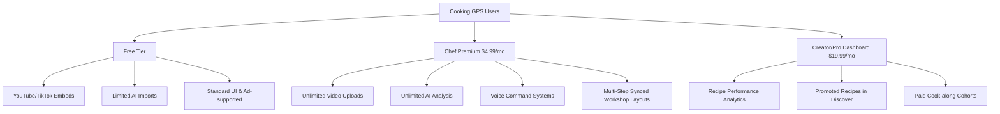

# Cooking GPS — Financial & Monetization Plan

This document outlines the financial projections, operating expenses, monetization strategies, and milestones for **Cooking GPS**. Use this plan to track and manage the financial viability of the application as it moves from prototype to production.

---

## 1. Executive Summary

Cooking GPS is an interactive, voice-controlled, video-based recipe platform. Because it relies heavily on **video storage/bandwidth** and **multimodal AI analysis**, managing infrastructure costs is the primary challenge. Our financial strategy focuses on:
1. **Minimizing early infrastructure costs** by leveraging free-tier platforms and embedding external video (YouTube/TikTok) rather than self-hosting all video files.
2. **Implementing a freemium model** where basic users use external video links with limited AI usage, while premium users get custom video uploads and unlimited AI features.
3. **Monetizing natural commerce flows** through affiliate grocery and cookware integrations.

---

## 2. Operating Expenses (OpEx) Projections

Below is an estimation of monthly costs across development phases.

### 2.1 Web Hosting & Database
* **Frontend/Backend Hosting (Vercel, Render, or Fly.io)**:
  * *Phase 1 (Prototype)*: $0 (Vercel Free / Render Free)
  * *Phase 2 (Beta)*: $20/month (Render/Fly.io Hobby plan for API server)
  * *Phase 3 (Production)*: $100+/month (Autoscaling instances, staging environments)
* **Database (Supabase / Neon / AWS RDS)**:
  * *Phase 1 (Prototype)*: $0 (Supabase Free tier)
  * *Phase 2 (Beta)*: $25/month (Supabase Pro tier to handle user counts, backups, and projects)
  * *Phase 3 (Production)*: $100+/month (Read-replicas, scaled connection pooling)

### 2.2 Storage & Bandwidth (The Video Challenge)
Self-hosted video uploads are highly resource-intensive.
* **Storage (AWS S3 or Cloudflare R2)**:
  * *Cloudflare R2* is highly recommended due to **zero egress fees**.
  * Storage costs: ~$0.015 per GB/month.
  * Bandwidth costs: $0.00 (with R2).
  * *Projections*:
    * 100 creator videos @ 150MB each = 15 GB ($0.23/month)
    * 1,000 creator videos @ 150MB each = 150 GB ($2.25/month)
    * 10,000 creator videos @ 150MB each = 1.5 TB ($22.50/month)
* **Video Delivery CDN (Cloudflare)**:
  * Bandwidth is free with R2, but dynamic streaming performance (HLS transcoding) might eventually be needed.
  * *HLS Transcoding (e.g., Mux or AWS Elemental)*: ~$0.05 per minute of video processed, and ~$0.0013 per minute of video streamed. This is a Phase 3 optimization.

### 2.3 AI & Multimodal LLM Processing
Our core value proposition relies on analyzing videos (extracting audio, detecting boundaries, generating steps).
* **Gemini 2.5 Flash API (Google AI Studio)**:
  * *Free Tier*: 15 RPM (Requests Per Minute), 1,500 RPD (Requests Per Day) — *Excellent for prototype and early beta*.
  * *Pay-As-You-Go Tier*:
    * Input prompt: $0.075 / 1M tokens
    * Output prompt: $0.30 / 1M tokens
    * Video processing: ~260 tokens per second of video.
  * *Cost per AI Recipe Generation*:
    * A 5-minute (300 seconds) video = ~78,000 input tokens.
    * Prompt instructions + system instructions = ~2,000 tokens.
    * Output recipe JSON = ~2,000 tokens.
    * *Total cost per run*: `(80,000 * $0.000000075) + (2,000 * $0.00000030) = $0.006 + $0.0006 = $0.0066` (less than **1 cent per recipe analyzed**).
  * *Monthly AI Cost Projections*:
    * 500 recipe generations/month = $3.30
    * 5,000 recipe generations/month = $33.00
    * 50,000 recipe generations/month = $330.00

### 2.4 Authentication & Identity (Clerk)
* **Free Tier**: Up to 10,000 Monthly Active Users (MAU).
* **Pro Tier**: $25/month base (includes 10,000 MAU, then $0.02 per additional MAU).
* *Projections*: Free tier is sufficient for early launch; scale to Pro as user base grows.

---

## 3. Monetization Strategy

To balance these costs, Cooking GPS will implement a multi-tiered monetization strategy.

### 3.1 B2C: Chef Premium Subscription ($4.99 / month)
A subscription designed for home cooks who use the app in the kitchen daily.
* **Benefits**:
  * Ad-free cooking experience.
  * Unlimited video uploads (stored in Cloudflare R2).
  * Unlimited AI recipe generations.
  * Synced multi-step workshop mode (ideal for tablet/desktop kitchen setups).
  * Advanced voice commands (custom playlists, read-aloud timers).

### 3.2 B2B/B2C: Creator Pro Tier ($19.99 / month)
For culinary influencers, food bloggers, and chefs who want to share premium content.
* **Benefits**:
  * Detailed analytics on recipes (which steps get looped the most, average cook times, drop-off rates).
  * Custom branding on recipes.
  * Ability to embed affiliate links in the steps.
  * Sell "Premium Cook-along Courses" with gatelocked recipes.

### 3.3 Affiliate & Commerce Integration (Transactional)
* **Smart Shopping Lists**: Leverage APIs like Instacart, Amazon Fresh, or Kroger. When a cook clicks "Order Ingredients," the items are populated into their cart. Cooking GPS earns a 1%–5% affiliate commission.
* **Cookware Affiliates**: In the notes/description of a recipe step (e.g., "Use a 12-inch Cast Iron Skillet"), creators can link their favorite cookware. Cooking GPS can share affiliate commissions with the creator (e.g., 50/50 split of Amazon Associates revenue).

---

## 4. Cost vs. Revenue Projections (Scenario Analysis)

A projection modeling 1,000 active users (assuming 5% Premium conversion).

| Metric | Basic User (950) | Premium User (50) | Total / Month |
| :--- | :--- | :--- | :--- |
| **Subscription Revenue** | $0.00 | $4.99 × 50 = $249.50 | **$249.50** |
| **Affiliate Commissions (Est.)** | $0.20/user = $190.00 | $1.00/user = $50.00 | **$240.00** |
| **Gross Monthly Revenue** | $190.00 | $299.50 | **$489.50** |
| **Database & Hosting Costs** | — | — | -$45.00 |
| **Storage (Cloudflare R2)** | — | — | -$10.00 (avg 500GB) |
| **AI (Gemini API Calls)** | 2 runs/user = 1,900 runs | 20 runs/user = 1,000 runs | -$19.14 (2,900 runs) |
| **Authentication (Clerk)** | — | — | $0.00 (under 10k MAU) |
| **Net Operating Margin** | — | — | **+$415.36** |

> [!NOTE]
> Even with a conservative 5% premium conversion rate, the low API costs of Gemini 2.5 Flash and egress-free storage of Cloudflare R2 make the project profitable at small scales.

---

## 5. Financial Action Items & Milestone Tracker

Use this checklist to track your setup progress. Mark items as completed as we configure the accounts and billing infrastructure.

### Phase 1: Prototype & Cost Minimization
* [ ] **AI API Cost Management**:
  * [ ] Set up a Google AI Studio account and configure Gemini API key.
  * [ ] Add rate limits in backend API server code to prevent API abuse.
* [ ] **Video Hosting Strategy**:
  * [ ] Set up a Cloudflare account.
  * [ ] Create an R2 bucket for video uploads.
  * [ ] Set up CORS policies on R2 to permit video playback from local frontend.
* [ ] **Database & Server Hosting**:
  * [ ] Set up a free-tier project on Supabase or Neon.
  * [ ] Deploy prototype backend to Render/Fly.io (Free tier).

### Phase 2: Beta Launch & Initial Monetization
* [ ] **Authentication & User Limits**:
  * [ ] Configure Clerk dashboard (Free tier up to 10k MAU).
  * [ ] Implement user metadata flags to distinguish `isPremium` status.
  * [ ] Set upload size limits on the backend for non-premium users (e.g., max 50MB per video).
* [ ] **Billing Integration**:
  * [ ] Create a Stripe Developer account.
  * [ ] Set up a subscription product in Stripe for "Chef Premium" ($4.99/mo).
  * [ ] Configure a Stripe webhook handler on the backend to listen for successful payments and toggle `isPremium` in the local DB.
  * [ ] Implement Stripe Customer Portal so users can manage/cancel subscriptions.

### Phase 3: Commercial Scale & Partnerships
* [ ] **Affiliate Integrations**:
  * [ ] Apply for Amazon Associates program for cookware affiliate links.
  * [ ] Research Instacart API or Whisk API for grocery list integrations.
* [ ] **Infrastructure Optimization**:
  * [ ] Migrate database to a paid Supabase/Neon plan.
  * [ ] Configure AWS Elemental / Mux if automated video transcoding is required for smoother mobile playback.
